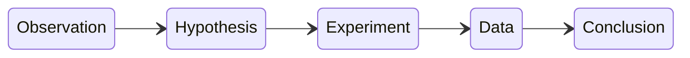

Parts of biological science:
1. Observation
2. Identification
3. Experiment
4. Theoretical explanation of natural phenomena
### The scientific method is used for verification of theories
1. Observations are carried out
2. Observations lead to a hypothesis which explains the observation
3. An experiment is carried out
4. The experimental data is analyzed
5. Determine the veracity of the hypothesis
or in summary: 

Hypothesis - a proposed explanation for some natural phenomena that can be validated or negated via experiment
Theory - a comprehensive explanation of some phenomena, backed by a lot of evidence. Lets you make a lot of predictions. Because of the high amount of evidence, theories are likely to be correct.

Data is usually divided into experimental and control groups which differ in only one variable
Data analysis - must be done correctly with respect to significant digits and whatnot

---
Different branches examine life at different levels and using different methods
- Zoology
- Molecular biology
- etc.
---
Model organisms
- Escherichia coli/E coli (bacteria)
- Saccharomyces cerevisiae (yeast)
- Drosophila melanogaster (fruit fly)
- Caenorhabditis elegans (worm)
- Mus musculus (mouse)
- Arabidopsis thaliana (plant)
All of these reproduce in very short times for their organism classes