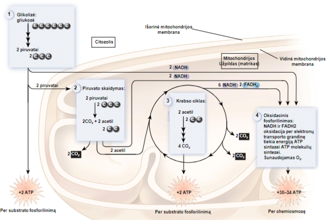

2024-09-20 10:57

Tags: #biology #metabolism

# Breathing
The process by which cells extract energy from chemical  bonds
The end goal is to synthesize ATP and NADH
- Aerobic breathing uses O2
- Anaerobic breathing
	- Naudojamos kitos medžiagos kaip galutiniai elektronų akceptoriai elektronų transporto grandinėje vietoje O2 
	- Gamina ATP tik per substrato fosforilinimą
## Glucose metabolism
4 Metabolic pathways:
- Step 1 - [[Glycolysis]] - occurs in the cytosol - produces 2 x Pyruvate, 2 x ATP,  2 x NAHD
- Step 2 - [[Piruvato skaidymas]] - occurs in the mitochondrial matrix - 1  pyruvate to CO2 and acetyl group that gets attached to CoA, also NADH
- Step 3 - [[Krebs cycle]] - 2 CO2 3 NADH, 1 FADH2 1 ATP produced from 1 acetyl group
- Step 4 - [[Oksidacinis fosforilinimas]] - 30 - 34 ATP are produced from 1 glucose worth of stuff, compared to the 2 + 2 from stages 1 and 3

Graphic overview
- NADH oksidacija lemia elektrocheminį gradientą reikalingą ATP sintezei 
- 30-34 ATP molekulės susidaro iš vienos gliukozės molekulės skaidymo iki CO2 ir H2O 
- Retai pasiekiamas maksimalus kiekis, nes 
	- NADH panaudojamas anaboliniuose keliuose 
	- H+ gradientas naudojamas ir kitais tikslais

# References
