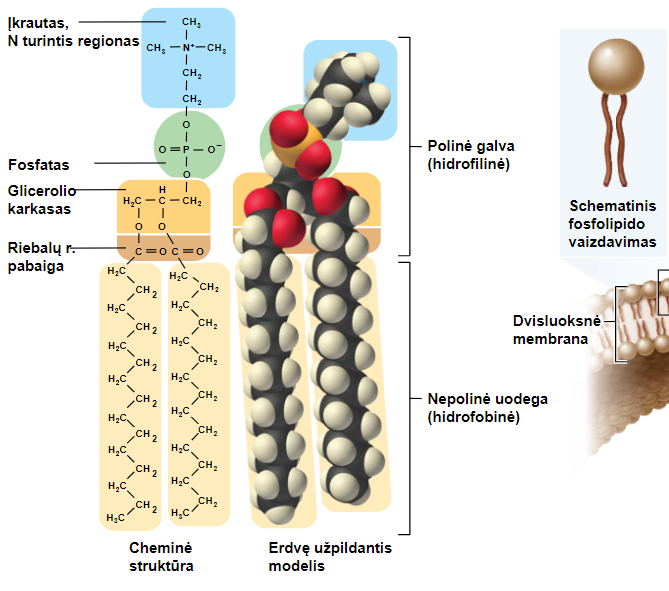
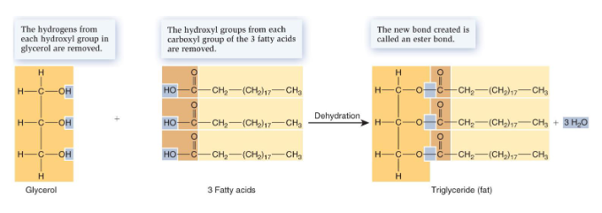
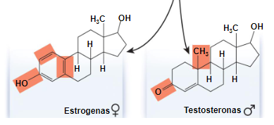

- Cn(H2O)n
- All have [stereoisomers](Stereoisomerism.md) 
- ### Monosaccharides
	- Usually 5 or 6 carbons
	- Pentozės – ribozė (C5H10O5), deoksiribozė (C5H10O4)
	- Heksozės – gliukozė (C6H12O6)
	- Can be linear or cyclic
- ### Disaccharides
	- Made of two monosaccharides (wow)
	- Made during dehydration or condensation "glikozidinis ryšys"
	- Dissolve via hydrolysis
- ### Polysaccharides
	- Many monomers linked together
	- Used for: energy storage (starch), structural stability (cellulose, chitin) 
- ### Lipids
	- Non-polar
	- Mostly C and H (boring)
	- **Phospholipids**
		- Glycerol, two fatty acids and a phosphate group
		- 
		- These make up lipid bilayers (dvisluoksnė membrana)
- ### Fats
	- Triglycerides
	- Very energy dense - 
	- Glycerol + 3 fatty acids
	- Created with dehydration or condensation
	- Breaks down via hydrolysis
	- 
	- #### **Fatty acids**
		- Saturated
			- Solid at room temp.
		- Unsaturated
			- Usually cis
			- Usually liquid at room temp
			- trans are created during a synthetic process - a certain bond???
- ### Steroids
	- Four fused rings
	- slightly soluble in water
	- Small differences in structure lead to large variations in effect
	- 
- ### [[Proteins]]
	