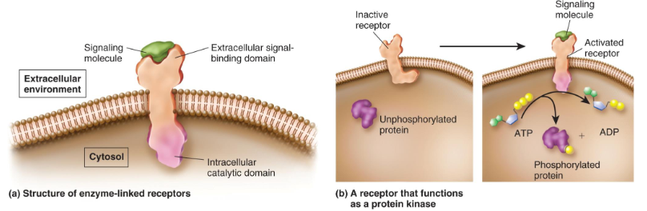

Signals affect the receptors conformation
## Why
Cells must react to their changing environment

- Yeast cells reacting to glucose and secreting glucose enzymes and transport proteins to effectively use it.
Cells need to communicate with each other
- Fototropizmas
-  auksinas yra signalinė molekulė keliaujanti iš ląstelės į ląstelę ir slopinama šviesos
- Kad augalas suktųsi į šviesą, kažkas detectino dabar kažkam reik bendint. 
## Ways

1. Tiesioginis tarpląstelinis signalas - Ląstelių jungtys leidžia signalinei molekulei pereiti iš vienos į kitą ląstelę
2. Kontakto nulemtas signalas - Kai kurios molekulės yra susirišusios su ląstelės paviršiumi ir tarnauja signalu kitai, kontaktui artėjančiai, ląstelei.
3. Autokrininis signalas - Ląstelės sekretuoja signalines molekules, kurios jungiasi prie jas sekretuojančių ląstelių arba prie šalia esančių tokių pačių ląstelių 
4. Parakrininis signalas - Signalas neturi poveikio jį sekretuojančiai ląstelei, tačiau veikia šalia esančias ląsteles (sinaptinis signalas) 
5. Endokrininis signalas - Signalai (hormonai) keliauja toli nuo ląstelės iki ląstelės taikinio ir paprastai turi ilgesnį gyvavimo laiką

Detailed signal mechanism:
1. Receptoriaus aktyvinimas 
2. Signalo perdavimas 
	- Aktyvintas receptorius sukelia seką pasikeitimų – signalo perdavimo kelią 
1. Ląstelinis atsakas, keli variantai: 
	1. Keičiamas 1-o ar daugiau fermentų aktyvumas 
	2. Keičiama struktūrinio baltymo f-ja 
	3. Pasikeitimai geno raiškoje – transkripcijos veiksniai (ang. factor)
## Receptors

