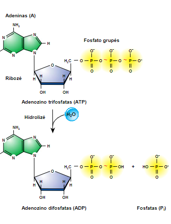
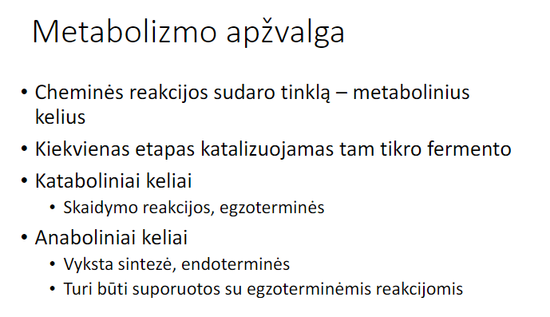

## ATP

deltaG = -7.3 kcal/mol

svarbu kad bendra reakcija butu deltaG neigiama aka suma deltaG visu reakcijų.
Enzymes speed up reactions, but don't change the deltaG, they lower the potential "hill". (smaller Ea - higher $\mathbf{k = A*e^{\frac{-E_a}{RT}}}$)

