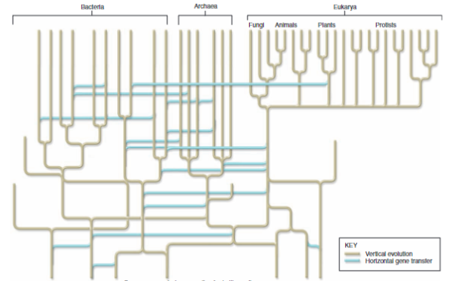

- Even very different organisms share evolutionary history - we can see this by looking at their bones.
  
  Even though they do not look similar, we can recognize the same general bone structure that has simply adapted to fit its role.
---
Evolutionary changes happen in two ways:
- Vertical gene transfer (classic)
	- Changes happen in a temporal tree
	- New species come into being via an accumulation of mutations
	- Natural selection helps helpful mutations to arise in a population
- Horizontal gene transfer
	- Genetic trade between different species
		- Viruses
		- Happens more often between bacteria
		- Plants incorporated a photosynthesizing bacteria's genome - this  gave rise to chloroplasts
		- A bacterium also gave rise to mitochondria
	- Relatively rare
