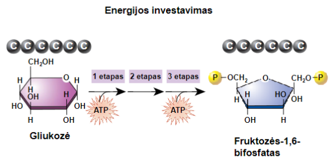
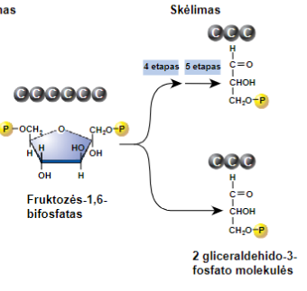
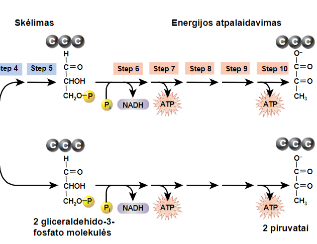

- Glycolysis is independent of oxygen
- Is the same for almost all organisms
- 10 steps over 3 phases
## Phases
1. Energy investment
	- 1-3 steps
	- Hydrolysis of 2 ATP,  kad susidarytų fruktozės-1,6-bifosfatas
- Fission
	- 4-5 steps
	- 6 anglies atomų molekulė suskaidoma į 3 anglies atomų gliceraldehido-3-fosfato dvi molekules 
3. Energijos atpalaidavimas 
	- 6-10 etapai 
	- Dvi gliceraldehido-3-fosfato molekulės skaidomos į 2 piruvato molekules ir susintetinamos 2 NADH bei ATP 
**Viso: susintetinamos 2 ATP**
The Idea: attach phosphate groups to OH groups, then oxidatively cleave them
### Phase 1

### Phase 2

### Phase 3

---

