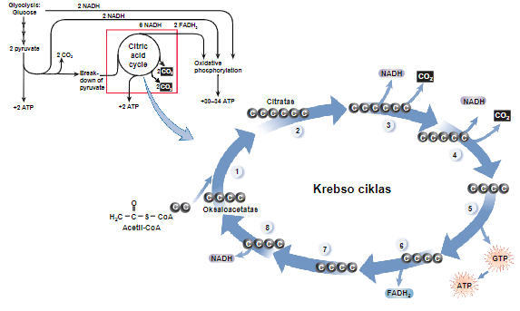

Metabolinis ciklas 
- Į ciklą įsijungia tam tikros molekulės, tuo tarpu kitos ciklą palieka. Kiekvieno ciklo metu vyksta serija organinių molekulių regeneracijų. 
- Acetilo grupė šalinama nuo acetil-CoA ir prijungiama prie oksaloacetato taip susidarant citratui arba citrinos rūgščiai. 
- Eilės etapų metu atpalaiduojamos: 2 CO2, 1 ATP, 3 NADH ir 1 FADH2 - Oksaloacetatas regeneruojamas ir vėl dalyvauja cikle
