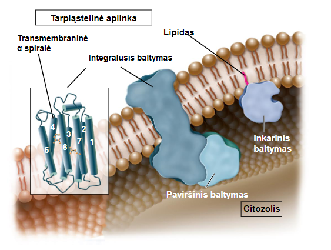

[[Proteins]]

Made from phospholipid bilayers but not only them.
Membranose taip pat išsidėsto baltymai ir angliavandeniai • santykiniai šių medžiagų kiekiai gali varijuoti

## Takiosios mozaikinės membranos modelis
- Membrana laikoma lipidų, baltymų ir angliavandenių mozaika
- Membrana pasižymi takumo savybėmis, nes lipidai ir baltymai santykinai gali judėti vieni kitų atžvilgiu membranoje

## Baltymai membranoje
• Integraliniai arba vidiniai membranų baltymai 
	• Transmembraniniai baltymai 
		• Vienas ar daugiau regionų fiziškai yra išsidėstę hidrofobinėje dvisluoksnio dalyje 
	• Inkariniai, lipido inkaruoti, baltymai 
		• Baltymas kovalentiškai prijungtas prie lipido per šoninę aminorūgšties grandinę 
• Paviršiaus arba išoriniai membranų baltymai 
	• Nekovalentiškai prisijungę prie integralių baltymų, kurių dalys kyšo už membranos, arba prisijungę prie polinių fosfolipidų galvučių
A very substantial part of all proteins encoded in our genome are transmembrane proteins. (1/4 - 1/3)
-> membranes are very important

## Takumas
Lankstumas nelaužant kovalentinių ryšių

Persimetimas **nevyksta savaime**, jam reikalingas baltymas kuris su ATP gali permesti lipidą.
**Veiksniai**
- Grandinių ilgis
	- Trumpesnės - tankesnės
- Dvigubi ryšiai
	- takesnės nes shittier cohesion
- Cholesterolis
	- Stabilizuoja
	- priklauso nuo temp

Ne visi gali integraliniai baltymai gali judėti. gali būti fixed

## Transport through

Selective transport through the membrane
Transport types:
- Passive
	- Diffusion - no energy/proteins required for transfer.
	- Assisted diffusion - diffusion using a protein channel but no energy
- Active
	- Uses ATP to transport stuff  *against* the concentration gradient. (a gate)

## Concentration gradients:
Homeostasis
Gradients: Chemical and Electrical (woowee)
## Large molecule transport
