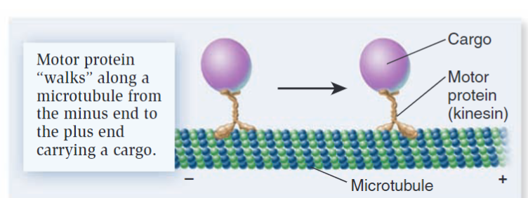

Motor proteins are a category of proteins that use ATP as a source of energy to promote various types of movements

## Movement
- Jis naudoja ATP kad pajudinti save pirmyn, prisikabina, atsikabina, pasuka kūną į priekį, prisikabina, patrauka tail į priekį ir kartoja tai
- There are three possible modes of movement:
	- movement of cargo via the motor protein - In the example shown in Figure 4.11a, the tail region of a motor protein called kinesin is attached to a cargo, so the motor protein moves the cargo from one location to another.
	- 
	- movement of the filament - Alternatively, a motor protein called myosin can remain in place and cause the filament to move (Figure 4.11b). This occurs during muscle contraction, which is described in Chapter 44.
	- bending of the filament -A third possibility is that both the motor protein and filament are restricted in their movement due to the presence of linking proteins. In this case, when motor proteins called dynein attempt to walk toward the minus end, they exert a force that causes the microtubules to bend