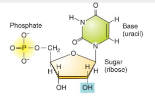

**Nukleotidas = fosforo rūgšt. (fosfatinė gr.) + cukrus (pentozė) + azotinė bazė**

**Dvi klasės:**
-  Deoksiribonukleorūgštys (**DNR**) 
	 - Saugo genetinę informaciją užkoduotą sekoje, sudarytoje iš deoksiribonukleotidų – monomerinių DNR komponentų 
	 - C**T**AG; C interacts only with G, A only with T because of the structures.
	 - Dvigrandinė spiralė
	 - More stable 
	
-  Ribonukleino rūgštys (**RNR**) 
	- Atsakingos už genetinės informacijos dekodavimą ir taikymą sujungiant tarpusavyje tam tikra seka aminorūgštis, kad susidarytų polipeptidinė grandinė
	- C**U**AG
	- Vinagrandinė spiralė
	- Less stable