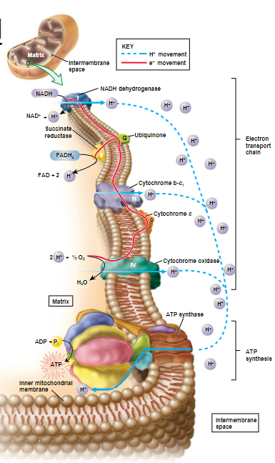

Aukštos energijos elektronai šalinami nuo NADH ir FADH2 ir taip sintetinama ATP 
- Energija gauta iš NADH ir FADH2 oksidacijos yra naudojama pumpuoti H+ į intermembrane space (that's why it's there in the first place), tada susidaręs elektrocheminis koncentracijos gradientas naudojamas ATP sintazės
- Fosforilinimą atlieka ATP sintazė

