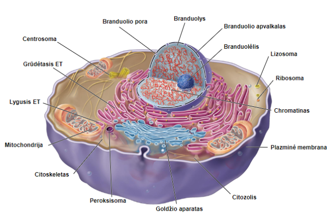

### Cytosol 
 The region of a eukaryotic cell that is outside the membrane- bound organelles but inside the plasma membrane
 - Certain steps of Anabolism(molecule synthesis) and Catabolism(breaking down of molecules) happen inside the Cytosol
 - Pvz. Ribosomes make proteins, and are sometimes found freely floating in the cytosol
### Cytoskeleton
Iš principo tai yra suma visų struktūrų kurios palaiko organizaciją kitų organelių - ląstelės karkasas 
In animal cells egzistuoja centrosoma, nuo kurios visi mikrovamzdeliai auga. 

### Nucleus
### Vacuoles
- Very varied function  - from digestion, to structural rigidity, to expulsion of water.