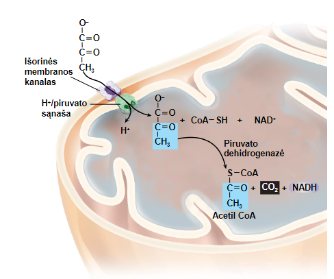

Eukariotuose piruvatas pernešamas į mitochondrijų užpildą (matriksą) 
- Skaidomas fermento piruvato dehidrogenazės 
- Nuo kiekvieno piruvato atskyla po CO2 
- Likusi acetilo grupė jungiasi su kofermentu A (CoA) 
- Iš kiekvieno piruvato susidaro po 1 NADH
Bendra reakcija: 

