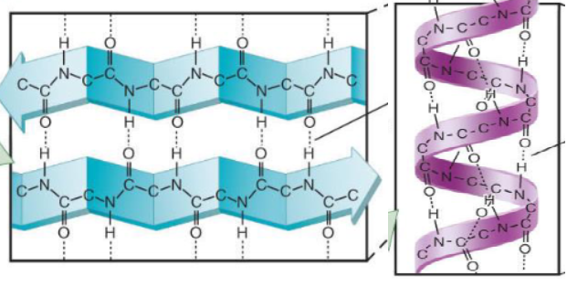
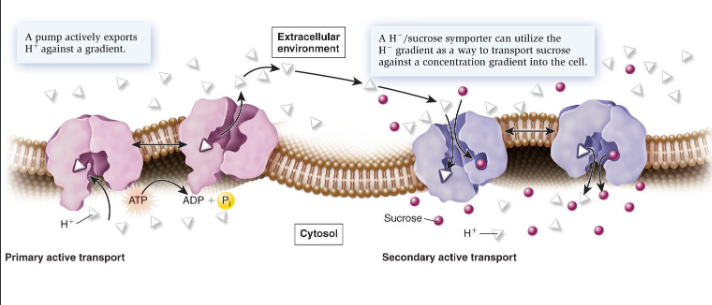

- [[Amino acid]] polymers
- Amino acids join via peptide bonds to make polypeptides
- Proteins consist of 1 or more polypeptide chains
- Break down via hydrolysis
---
### Protein structures are separated into 4 levels
#### **Pirminė** - amino acid chain - polypeptide, determined by genes
#### **Antrinė** - repeated structures like **alpha helices** and **beta sheets** form because of polar and non-polar attraction, also areas of "random structure" which are neither $\alpha$ nor $\beta$ yet still very important for function of the protein

#### **Tretinė** - folding - determines complex 3d structure, the final step if the protein consists of 1 polypeptide chain
#### **Ketvirtinė** - 2 or more polypeptides - the whole protein with all polypeptides chains incorporated (multimeric protein)

---
### 5 Key factors affecting folding and stability
1. Hydrogen bonds
2. Ionic bonds and other polar interactions
3. Hydrophobic effects
4. Van der Walls forces
5. Disulphide bonds

---
Proteins often interact with each other, the interaction happens on a specific surface of the protein determined by the first four key factors
[[Membranes]]
Transport proteins
- Transmembrane proteins allow diffusion through membranes
- Channels
	- Creates a way for diffusion, are controlled, allow water
- Carriers
	- Conformational changes transport things. 
	- Main way for organics to enter the cell
		- Uniporter - one mol. one dir. 
		- Symporter,  >1 mol. one dir.
		- Antiporter any mol. any dir.
- **Active**
	- against gradient, needs ATP
	- Primary uses siurbliai simple dimple
	- Secondary uses one molecule for which the concentration gradient is favorable to transport another for which it isn't
	
